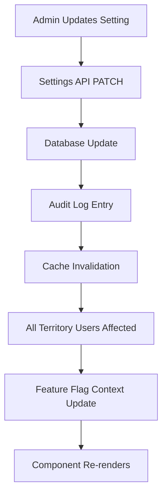
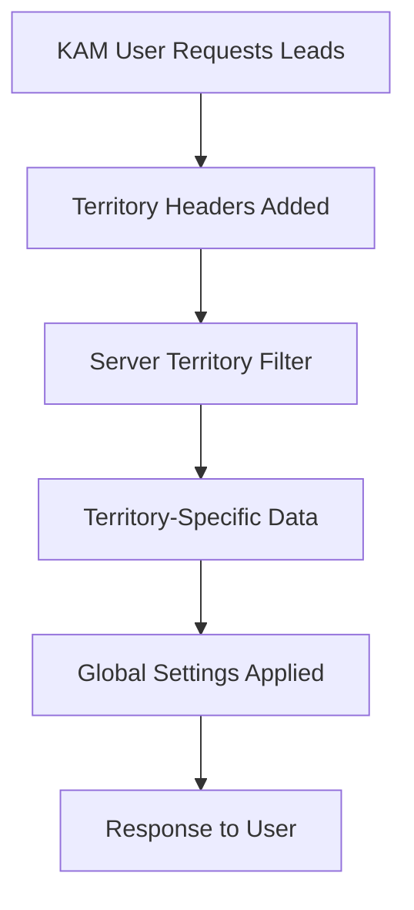

# API Territory Management Documentation

## Overview

The Solarium Web Portal implements sophisticated territory-based access control that automatically filters data based on user geographic assignments. This document details the implementation, usage patterns, and integration points for territory management.

## Territory System Architecture

### Territory Types
```typescript
type Territory = 
  | 'North' | 'South' | 'East' | 'West' | 'Central'
  | 'Northeast' | 'Northwest' | 'Southeast' | 'Southwest';
```

### User Territory Assignment
Users can be assigned multiple territories, with different access patterns:

```typescript
interface User {
  id: string;
  role: UserRole;
  territories: Territory[];
  // ... other properties
}

// Access patterns by role
const accessPatterns = {
  admin: { hasFullAccess: true, territories: [] },      // All territories
  kam: { hasFullAccess: false, territories: ['North', 'South'] }, // Assigned territories
  cp: { hasFullAccess: false, territories: ['East'] },  // Single territory
  customer: { hasFullAccess: false, territories: [] }   // No territory access
};
```

## Settings API Integration

The Settings Management system integrates with territory-based access control while maintaining admin-only restrictions:

### Access Control Matrix

| Role | Settings Access | Territory Filtering | Audit Log Access |
|------|----------------|-------------------|------------------|
| Admin | ✅ Full | ❌ None (All data) | ✅ Full |
| KAM | ❌ Denied | ✅ Assigned territories | ❌ Denied |
| CP | ❌ Denied | ✅ Assigned territories | ❌ Denied |
| Customer | ❌ Denied | ❌ None | ❌ Denied |

### Settings Endpoints Territory Behavior

#### GET /api/v1/settings
- **Admin**: Returns global settings (no territory filtering)
- **Non-Admin**: Returns 403 Forbidden
- **Territory Headers**: Not applicable (admin-only endpoint)

```typescript
// Settings endpoint - admin only, no territory filtering
export const getSettings = builder.query<SystemSettings, void>({
  query: () => '/api/v1/settings',
  // No territory injection for settings
});
```

#### PATCH /api/v1/settings
- **Admin**: Can update any setting globally
- **Non-Admin**: Returns 403 Forbidden
- **Territory Impact**: Settings changes affect all territories uniformly

```typescript
// Settings update - global impact, admin only
const handleSettingsUpdate = async (updates: SettingsUpdatePayload) => {
  // Admin role verified server-side
  // Changes apply to all territories
  await updateSettings(updates).unwrap();
};
```

#### GET /api/v1/settings/audit
- **Admin**: See all settings changes across all territories
- **Non-Admin**: Returns 403 Forbidden
- **Audit Scope**: Global audit trail, not territory-filtered

## Territory Header Injection

### Automatic Header Addition
The API slice automatically injects territory information for non-settings endpoints:

```typescript
const baseQueryWithTerritoryInjection = fetchBaseQuery({
  prepareHeaders: (headers, { getState }) => {
    const user = getState().auth.user;
    
    // Add territory headers for access control
    if (user?.role === 'kam' && user.territories?.length > 0) {
      headers.set('X-User-Territories', user.territories.join(','));
      headers.set('X-Territory-Filter', 'include');
    }
    
    // Settings endpoints don't use territory headers (admin-only)
    return headers;
  },
});
```

### Territory Query Parameters

For data endpoints (non-settings), territory parameters are automatically injected:

```typescript
// Example for leads endpoint (NOT settings)
const getLeads = builder.query<Lead[], LeadQuery>({
  query: (params) => {
    // Territory params automatically added for KAM users
    // Settings endpoints bypass this logic
    return `/api/v1/leads?${buildQueryString(params)}`;
  },
});
```

## Settings-Specific Territory Considerations

### 1. Feature Flag Territories
Feature flags set through Settings affect all territories uniformly:

```typescript
// Feature flag update - global scope
const updateFeatureFlag = async (flag: string, value: boolean) => {
  // This change affects ALL territories
  await updateFeatureFlag({ flag, value }).unwrap();
  
  // All users across all territories see the change
  console.log(`Feature ${flag} set to ${value} globally`);
};
```

### 2. Threshold Settings
Numeric thresholds apply globally across territories:

```typescript
// Example: Session timeout affects all users regardless of territory
const globalSettings = {
  sessionTimeoutMin: 45,        // Applied globally
  thresholds: {
    MAX_LEADS_PER_PAGE: 100,   // Applied to all territory-filtered lead queries
  }
};
```

### 3. Territory-Aware Components
Components that depend on both settings and territory data:

```typescript
const TerritoryDashboard = () => {
  const { user } = useAuth();
  const { data: settings } = useGetSettingsQuery();
  const territoryAccess = getUserTerritoryAccess(user);
  
  // Use global settings with territory-filtered data
  const pageSize = settings?.thresholds.MAX_LEADS_PER_PAGE || 50;
  const { data: leads } = useGetLeadsQuery({
    territories: territoryAccess.territories,
    limit: pageSize,
  });
  
  return (
    <Dashboard 
      leads={leads} 
      settings={settings}
      territoryInfo={territoryAccess}
    />
  );
};
```

## Security Considerations

### Settings Security Model
```typescript
// Security layers for settings access
const settingsSecurityLayers = {
  route: 'Admin role required for /settings route',
  api: 'Admin token validation on all settings endpoints',
  ui: 'Settings navigation hidden for non-admin users',
  audit: 'All settings changes logged with user attribution',
};
```

### Territory Security Model
```typescript
// Territory access verification
const verifyTerritoryAccess = (user: User, requestedData: any) => {
  if (user.role === 'admin') {
    return { allowed: true, scope: 'global' };
  }
  
  if (user.role === 'kam' && user.territories?.length > 0) {
    return { 
      allowed: true, 
      scope: 'territory', 
      territories: user.territories 
    };
  }
  
  return { allowed: false, scope: 'none' };
};
```

## Data Flow Examples

### Settings Change Propagation


### Territory Data Access


## Integration Patterns

### 1. Settings with Territory Context
```typescript
const useSettingsWithTerritory = () => {
  const { data: settings } = useGetSettingsQuery();
  const { user } = useAuth();
  const territoryAccess = getUserTerritoryAccess(user);
  
  return {
    settings,
    territoryAccess,
    canModifySettings: user?.role === 'admin',
    effectiveSettings: {
      ...settings,
      // Territory-specific overrides if needed
      pageSize: Math.min(
        settings?.thresholds.MAX_LEADS_PER_PAGE || 50,
        territoryAccess.territories.length * 25
      ),
    },
  };
};
```

### 2. Territory-Aware Settings Display
```typescript
const SettingsImpactIndicator = ({ setting }: { setting: string }) => {
  const { user } = useAuth();
  const territoryAccess = getUserTerritoryAccess(user);
  
  return (
    <Chip
      label={
        user?.role === 'admin' 
          ? 'Global Impact' 
          : `Affects: ${territoryAccess.territories.join(', ')}`
      }
      color={user?.role === 'admin' ? 'warning' : 'info'}
    />
  );
};
```

### 3. Audit Log Territory Context
```typescript
const TerritoryAuditContext = ({ auditEntry }: { auditEntry: SettingsAuditLog }) => {
  return (
    <Box>
      <Typography variant="body2">
        Setting: {auditEntry.field}
      </Typography>
      <Typography variant="caption" color="text.secondary">
        Global Impact: Affects all territories and users
      </Typography>
    </Box>
  );
};
```

## Best Practices

### 1. Settings Design Patterns
```typescript
// DO: Use global settings that apply uniformly
const globalSettings = {
  sessionTimeoutMin: 30,
  featureFlags: {
    ADVANCED_REPORTING: true,
  },
};

// DON'T: Create territory-specific settings in global config
const territorySpecificSettings = {
  northSettings: { /* ... */ },
  southSettings: { /* ... */ },
};
```

### 2. Territory-Aware Components
```typescript
// DO: Combine global settings with territory-filtered data
const DashboardWithSettings = () => {
  const { data: settings } = useGetSettingsQuery();
  const { user } = useAuth();
  const territoryData = useTerritoryFilteredData(user);
  
  return <Dashboard settings={settings} data={territoryData} />;
};

// DON'T: Try to filter settings by territory
const TerritorySettings = () => {
  // This is incorrect - settings are global
  const { data: territorySettings } = useGetSettingsQuery({
    territory: user.territories[0], // ❌ Wrong approach
  });
};
```

### 3. Access Control Verification
```typescript
// DO: Verify access at multiple layers
const SettingsPage = () => {
  const { user } = useAuth();
  const canAccess = user?.role === 'admin';
  
  if (!canAccess) {
    return <AccessDenied />;
  }
  
  return <SettingsContent />;
};

// Server-side verification also required
app.get('/api/v1/settings', requireAdmin, (req, res) => {
  // Double verification
  if (req.user.role !== 'admin') {
    return res.status(403).json({ error: 'Admin required' });
  }
  // ...
});
```

## Migration and Maintenance

### Adding New Territory Types
```typescript
// 1. Update territory types
type Territory = 
  | 'North' | 'South' | 'East' | 'West' | 'Central'
  | 'Northeast' | 'Northwest' | 'Southeast' | 'Southwest'
  | 'International'; // New territory

// 2. Update validation
const validateTerritory = (territory: string): territory is Territory => {
  return TERRITORIES.includes(territory as Territory);
};

// 3. Settings remain unaffected (global scope)
```

### Settings Impact Analysis
```typescript
// Tool for analyzing settings impact
const analyzeSettingsImpact = (setting: string, value: any) => {
  const impact = {
    scope: 'global',
    affectedUsers: 'all',
    affectedTerritories: 'all',
    riskLevel: getRiskLevel(setting, value),
  };
  
  console.log(`Setting ${setting} impact:`, impact);
  return impact;
};
```

## Troubleshooting

### Common Issues

1. **Settings not visible to KAM users**
   - ✅ Expected behavior - settings are admin-only
   - Solution: Use admin account for settings management

2. **Territory headers in settings requests**
   - ✅ Expected behavior - settings endpoints ignore territory headers
   - Settings apply globally, not per territory

3. **Feature flags not affecting territory-specific components**
   - Check feature flag context integration
   - Verify component subscription to settings updates

### Debug Tools
```typescript
// Development debugging
if (process.env.NODE_ENV === 'development') {
  window.__TERRITORY_DEBUG__ = {
    currentUser: () => store.getState().auth.user,
    territoryAccess: (user) => getUserTerritoryAccess(user),
    settingsScope: 'global - affects all territories',
    apiHeaders: () => {
      // Show current API headers being sent
    },
  };
}
```

---

This documentation covers the integration between Settings Management and Territory-based access control. The key principle is that **Settings are global and admin-only**, while **data endpoints use territory filtering for non-admin users**.

## Implementation

### 1. User Model Extension

Users now include a `territories` array:

```typescript
interface User {
  // ... other fields
  territories: Territory[]; // Array of assigned territories
}
```

### 2. Automatic Query Parameter Injection

RTK Query automatically injects territory parameters for KAM users:

```typescript
// For KAM user with territories ['North', 'East']:
GET /api/v1/leads?search=solar&territories=North,East

// For Admin user:
GET /api/v1/leads?search=solar
// (no territory filtering)
```

### 3. API Headers

Territory access information is sent via headers:

```http
# Admin users
X-Territory-Access: all

# KAM users  
X-Territory-Access: filtered
X-User-Territories: North,East
```

### 4. Client-Side Filtering

UI components use hooks to filter data:

```typescript
import { useTerritoryFilter } from '../hooks/useTerritoryFilter';

const MyComponent = () => {
  const allLeads = useGetLeadsQuery();
  const filteredLeads = useTerritoryFilter(allLeads.data);
  
  // filteredLeads only contains leads the user can access
};
```

## API Usage Examples

### Query Parameters

KAM users automatically get territory filtering:

```javascript
// This call:
api.getLeads({ search: 'solar', status: 'active' })

// Automatically becomes:
// GET /leads?search=solar&status=active&territories=North,East
```

### Territory Validation

Server-side validation ensures data integrity:

```javascript
// Validate before data modification
const validation = validateTerritoryAccess(user, 'North', 'write');
if (!validation.allowed) {
  throw new Error(validation.reason);
}
```

## Data Reduction Impact

Territory filtering significantly reduces data exposure:

- **Admin users**: See 100% of system data
- **KAM users**: See ~22% of system data (2/9 territories)
- **Reduction rate**: >80% for typical KAM users

## Testing

### Unit Tests

Territory utilities are comprehensively tested:

```bash
npm run test territory
```

Key test scenarios:
- Admin vs KAM data access
- Query parameter injection
- Client-side filtering
- Negative access validation

### Integration Tests

API integration validates:
- Automatic parameter injection
- Header setting
- Territory-based responses

## Security Considerations

1. **Server-side enforcement**: Territory filtering must be enforced on the backend
2. **Client-side filtering**: Provides UX optimization but not security
3. **Data validation**: All data modifications validate territory access
4. **Audit logging**: Territory access violations should be logged

## Development Guidelines

### Adding New Territory-Filtered Endpoints

1. Server endpoint should respect `territories` query parameter
2. Client endpoint automatically gets territory injection (no code changes needed)
3. Add tests for both admin and KAM user scenarios

### UI Components

Use territory hooks for consistent filtering:

```typescript
// ✅ Correct
const filteredData = useTerritoryFilter(rawData);

// ❌ Incorrect - manual filtering
const filteredData = rawData.filter(item => 
  user.territories.includes(item.territory)
);
```

### Testing New Features

Always test with both user types:

```typescript
describe('New Feature', () => {
  it('should allow admin full access', () => {
    // Test with mockAdminUser
  });
  
  it('should filter data for KAM users', () => {
    // Test with mockKamUser
  });
  
  it('should prevent out-of-scope access', () => {
    // Negative test with restricted data
  });
});
```

## Troubleshooting

### Common Issues

1. **KAM seeing no data**: Check territory assignments in user profile
2. **Query parameters not injected**: Verify RTK Query setup and user authentication
3. **Client-side filtering not working**: Ensure `useTerritoryFilter` hook is used correctly

### Debug Tools

Development environment provides territory debugging:

```javascript
// Browser console
window.__TERRITORY_DEBUG__ = true;

// This will log all territory filtering operations
```

## Performance Considerations

- Territory filtering reduces data transfer by >80% for KAM users
- Client-side filtering is memoized for performance
- API calls include territory headers to enable server-side optimizations 